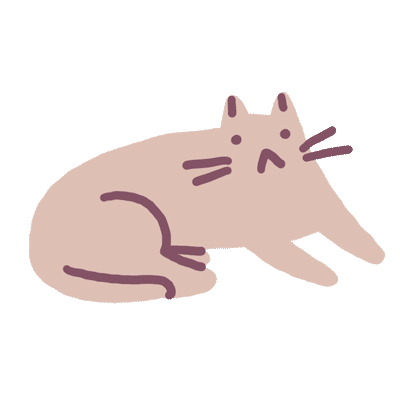

    

        
    

    
🌟 Welcome! 🌟

    <h4 align="left">My Projects</h4>
    <table border="1" cellpadding="10">
  <thead>
    <tr>
      <th>Project Name</th>
      <th>Description</th>
      <th>Technology Stack</th>
    </tr>
  </thead>
  <tbody>
    <tr>
      <td><a href="https://github.com/WooriFisa3-TeamOrg/daily-travel">daily-travel</a></td>
      <td>A smart travel management platform. 
          allowing users to plan and share their travel itineraries seamlessly.
      </td>
      <td>
        
      </td>
    </tr>
    <tr>
      <td><a href="https://github.com/WooriFisa3-TeamOrg/daily-travel-frontend">daily-travel-frontend</a></td>
      <td>Responsive front-end for travel planning. 
          offering a dynamic user interface for the daily-travel project.
      </td>
      <td>
        
        
      </td>
    </tr>
    <tr>
      <td><a href="https://github.com/ToTheMoonSimulation/ttms">ttms</a></td>
      <td>Virtual cryptocurrency investment platform. 
          Simulate investments with real-time market data.
      </td>
      <td>
        
        
      </td>
    </tr>
    <tr>
      <td><a href="https://github.com/AIMCookie/aimcookie">aimcookie</a></td>
      <td>AI-driven music creation tool. 
          this project provides an interactive canvas for creating music with AI support.
      </td>
      <td>
        
        
      </td>
    </tr>
    <tr>
      <td><a href="https://github.com/sidewinderk/gbfTransKor">gbfTransKor</a></td>
      <td>Game translation extension. 
          Translates in-game content from Japanese and Japanese to Korean.
      </td>
      <td>
        
        
      </td>
    </tr>
    <tr>
      <td><a href="https://github.com/recoild/excalidraw_selfhost_study">excalidraw_selfhost_study</a></td>
      <td>Optimized self-hosted whiteboard solution. 
          Focuses on self-hosting and Dockerfile optimization for faster build times.
      </td>
      <td>
        
      </td>
    </tr>
  </tbody>
</table>

